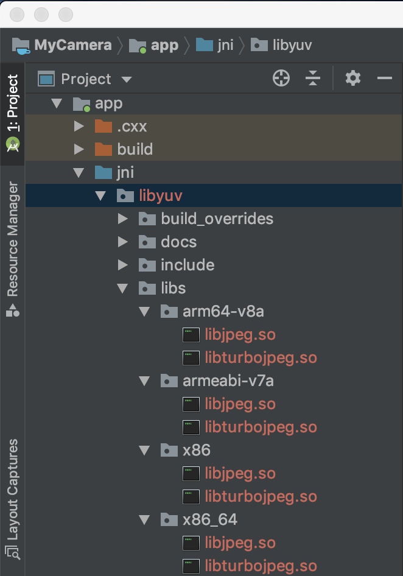

# libyuv-with-jpeg

## 背景说明
libyuv是Google开源的实现各种YUV与RGB之间相互转换、旋转、缩放的库。具体的介绍可以参考[官网介绍](https://chromium.googlesource.com/libyuv/libyuv)

本项目主要是用于在Android平台上，利用NKD编译包含libjpeg库的libyuv库。这个主要通过libyuv/Android.md中的如下代码实现：

```
include $(CLEAR_VARS)

LOCAL_WHOLE_STATIC_LIBRARIES := libyuv_static
LOCAL_MODULE := libyuv
ifneq ($(LIBYUV_DISABLE_JPEG), "yes")
LOCAL_SHARED_LIBRARIES := jpeg
endif

include $(BUILD_SHARED_LIBRARY)
```

## 需要下载的库
* [libyuv](https://chromium.googlesource.com/libyuv/libyuv)或者[libyuv](https//github.com/lemenkov/libyuv.git)
* [libjpeg-turbo](https://github.com/libjpeg-turbo/libjpeg-turbo.git)

## 编译依赖
#### NDK
1. 版本：NDK-r16b
2. NDK的版本限定主要是为了在编译libjpeg-turbo库的脚本中使用gcc编译而已，因为NDK-r17之后的版本，需要使用clang来编译so库了。

#### CMAKE, NASM, GCC等
该部分为编译libjpeg-turbo库的编译依赖，具体可以参见libjpeg-turbo的[BUILD.md](https://github.com/libjpeg-turbo/libjpeg-turbo/blob/master/BUILDING.md)

## 编译libjpeg-turbo
1. 编译脚本位于libjpeg-turbo目录下，共计有三个脚本
    1. config.sh：配置编译参数，例如ANDROID_NDK_ROOT等，需要根据自己的环境变量进行替换。
    2. build_jpeg.sh：编译某个CPU架构的so库，该脚本中的变量一般不需要修改。
    3. build_jpeg_all.sh：编译所有CPU架构的so库

2. 下载libjpeg-turbo源码：`git clone https://github.com/libjpeg-turbo/libjpeg-turbo.git`。

3. 将本仓库的libjpeg-turbo目录下的三个文件复制到libjepg-turob源码的根目录下：`cp -r libjpeg-turbo/* JPEG_SRC_ROOT_PATH/`。

4. 修改config.sh中的ANDROID_NDK_ROOT为自己的NDK路径。

5. 运行`sh build_jpeg_all.sh`编译libjpeg-turbo，运行之后会在当前目录的libs目录下生成各种CPU架构对应的so库。

## 编译libyuv
1. 下载libyuv的源码，并且将源码导入到Android Studio中的指定目录：PROJECT/app/jni/libyuv,该目录自己定义就可以。

2. 将上一步生成的so文件按照ABI的格式复制到libyuv/libs目录下，如下图所示：
    
    

3. 修改libyuv目录下的Android.mk文件，增加本仓库libyuv/Android.mk文件中的第4~12行的内容即可。

```
########################################################
## {{BEGIN 增加如下的代码
include $(CLEAR_VARS)
LOCAL_MODULE := jpeg
LOCAL_SRC_FILES := libs/$(TARGET_ARCH_ABI)/libjpeg.so
LOCAL_EXPORT_C_INCLUDES := $(LOCAL_PATH)/include
include $(PREBUILT_SHARED_LIBRARY)
## END}}
########################################################
```

4. 按照本仓库的myapp/jni目录下的Android.mk和Application.mk文件修改自己的对应文件即可，主要是用于编译libyuv使用。

5. 修改自己app目录下的build.gradle，在android{}中增加如下编译任务

```
externalNativeBuild {
    ndkBuild {
        path file('jni/Android.mk')
    }
}
```

6. 点击Android Studio的编译按钮编译即可。